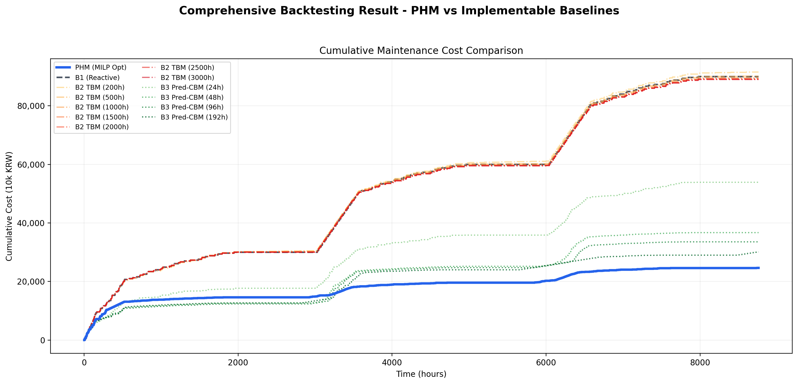

# AGV 예지보전(PHM) 및 MILP 기반 정비 일정 최적화 시스템

> **"각 AGV가 언제 고장날지 예측하여, 언제 어떤 AGV를 정비하는 것이 가장 경제적인가? 해법 도출"**

AI 기반 잔존수명(RUL) 예측과 최적화 모델을 결합하여 **AGV(자율주행차량) 정비 비용을 절감**하는 프로젝트입니다.

---

## 문제 정의 & 솔루션

### 시나리오
- **규모**: 자동화시설의 AGV 100대 운영
- **기간**: 1년(=8,760시간)
- **최적화 대상**: AGV 베어링 정비 유지보수 비용 (정비 베이 2개 제약)

### 기존 정비 방식의 문제점

| 방식 | 설명 | 문제 |
|------|------|------
| **B1) 사후정비** | 고장이 나면 정비 | 예기치 못한 다운타임 |
| **B2) 시간기반 정비(주기정비)** | 정기적으로 정비 | 실제 수명과 무관하게 정비 → 낭비 | 
| **B3) 예측 RUL 임계치 정비** | RUL 평균값 < 임계치면 정비 | RUL 예측 정보 활용하지만, 정비 베이 제약과 전체 비용 최적화 없음 | 

### 솔루션: PHM-MILP

**RUL 예측 + 최적화 = 선제적 정비**
- **예측** (LSTM + MC Dropout): 불확실성을 확률 분포로 모델링 → "언제 고장날까?"를 확률로 정량화
- **최적화** (MILP): 불확실성을 의사결정에 반영한 경제적 스케줄링 → 제약 조건(정비 베이 2개) 내에서 최저 비용 경로 결정

**결과**: 데이터 기반의 선제적 대응으로 **최저 비용 달성** | **24,650만 원/년**

---

## 핵심 성과

| 지표 | 기준선(B1 사후정비) 대비 | 절감 규모 |
|------|:---:|:---:|
| **총 운영 비용** | **72.6% ↓** | 90,000만 → 24,650만 원 |
| **비계획 고장** | **89.0% ↓** | 300건 → 33건 |
| **평균고장간격(MTBF)** | **+809%** | 29.2h → 265.5h |

> **100대 AGV를 1년간 운영하는 조건에서, 비계획 고장을 300건에서 33건으로 줄이고 총 운영 비용을 72.6% 절감**

---

## 솔루션 상세

### 1. RUL 예측 (LSTM + Monte Carlo Dropout)

**개념**: 시계열 데이터의 패턴을 학습하여 "언제 고장날까?"를 예측

```
- 시간에 따른 베어링 진동 → 패턴 학습 (LSTM)
- MC Dropout → 불확실성 고려 및 확률 분포 도출
```

**차별점**: 
- 단일 예측치가 아닌 **확률 분포** 도출
  - 예: "90시간 뒤 고장날 확률 60% / 110시간 뒤 고장날 확률 80%"
- 이를 통해 "기대 고장 비용"이 높은 차량을 우선적으로 정비

**사용 데이터**: NASA PRONOSTIA (FEMTO) 베어링 데이터셋 (실제 진동 센서 데이터)

### 2. 정비 일정 최적화 (MILP - Mixed Integer Linear Programming)

**개념**: 제약 조건 하에서 **최저 비용을 가지는 해를 찾는 알고리즘**

```
- 목적: (계획 정비 비용) + (방치 시 기대 고장 비용) 최소화
- 제약: 동시에 최대 2대만 정비 가능
```

**결과**:
- 단순히 RUL이 낮은 순서대로 정비하는 것이 아님
- 전체 AGV 상태 + 가용 정비 슬롯을 고려한 **최적점** 결정

---

## 시뮬레이션 결과

1년간(8,760시간)의 운영 시뮬레이션을 통해 기존 정비 전략 대비 성능을 평가하였습니다.



### 모든 Baseline 비교

B2 TBM 7개 주기(200h ~ 3000h)와 B3 Pred-CBM 4개 임계치(24h ~ 192h)에 대한 전수 탐색 결과입니다.

| 지표 | B1 | B2 (200h) | B2 (500h) | B2 (1000h) | B2 (1500h) | B2 (2000h) | B2 (2500h) | B2 (3000h) | B3 (24h) | B3 (48h) | B3 (96h) | B3 (192h) | **PHM** |
|:-----|:---:|:---:|:---:|:---:|:---:|:---:|:---:|:---:|:---:|:---:|:---:|:---:|:---:|
| **총 비용 (만원)** | 90,000 | 91,550 | 90,150 | 89,550 | 89,250 | 89,200 | 89,100 | 89,000 | 53,900 | 36,700 | 33,550 | 30,100 | **24,650** |
| **비계획 고장 (건)** | 300 | 294 | 296 | 296 | 296 | 296 | 296 | 296 | 150 | 84 | 72 | 53 | **33** |
| **계획 정비 (건)** | 0 | 67 | 27 | 15 | 9 | 8 | 6 | 4 | 178 | 230 | 239 | 284 | **295** |
| **가용률 (%)** | 99.1 | 99.1 | 99.1 | 99.1 | 99.1 | 99.1 | 99.1 | 99.1 | 99.1 | 99.2 | 99.2 | 99.4 | **98.7** |
| **MTBF (h)** | 29.2 | 29.8 | 29.6 | 29.6 | 29.6 | 29.6 | 29.6 | 29.6 | 58.4 | 104.3 | 121.7 | 165.3 | **265.5** |
| **절감률 vs B1** | 기준 | -1.7% | -0.2% | 0.5% | 0.8% | 0.9% | 1.0% | 1.1% | 40.1% | 59.2% | 62.7% | 66.6% | **72.6%** |

**주요 발견**:
- **B2 TBM**: 주기가 길수록 비용 절감 (최적 3000h에서 1.1% 절감), 하지만 PHM의 10% 수준
- **B3 Pred-CBM**: 임계치가 길수록 비용 절감 (최적 192h에서 66.6% 절감), 예측 정보의 가치 입증
- **PHM-MILP**: 모든 baseline 상회. B1 대비 **72.6% 절감** 달성 — MILP 최적화의 추가 가치 7% 포인트

---

## Project Structure

```
PHM_ai_optimization/
├── src/
│   ├── data_pipeline/      # NASA 데이터 전처리 & 특징 추출 (14종 Feature)
│   ├── models/             # LSTM 모델 & MC Dropout 추론 로직
│   ├── optimization/       # MILP 기반 정비 최적화 모델
│   └── simulation/         # 10대 AGV 상태 머신 & 시나리오 엔진
├── backtesting/
│   ├── backtesting.py      # 1년 시뮬레이션 수치 검증
│   └── backtesting_results.md
└── docs/                   # 기술 문서 & 분석 리포트
```

---

## Quick Start

```bash
# 1. 의존성 설치
uv pip install -r requirements.txt

# 2. 백테스팅 실행 (수치 결과 확인)
uv run python backtesting/backtesting.py
```
