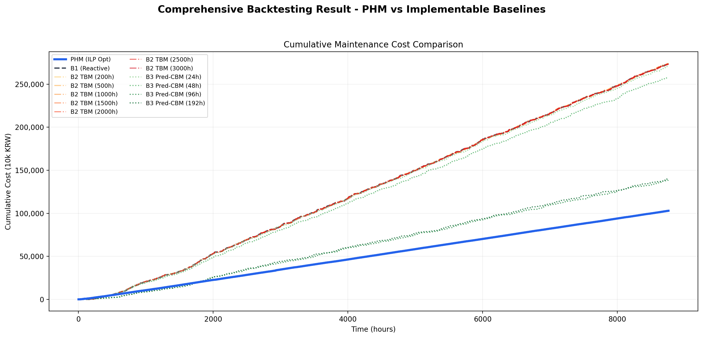

# AGV 예지보전(PHM) 및 ILP 기반 정비 일정 최적화 시스템

> **"각 AGV가 언제 고장날지 예측하여, 언제 어떤 AGV를 정비하는 것이 가장 경제적인가? 해법 도출"**

AI 기반 잔존수명(RUL) 예측과 스케줄링 최적화 모델을 결합하여 **AGV(자율주행차량) 정비 비용을 절감**하는 프로젝트

---

## 문제 정의 & 솔루션

### 시나리오
- **규모**: 자동화시설의 AGV 100대 운영
- **기간**: 1년(=8,760시간)
- **최적화 대상**: 전체 AGV 정비 유지보수 비용

### 기존 정비 방식의 문제점

| 방식 | 설명 | 문제 |
|------|------|------
| **사후정비** | 고장이 나면 정비 | 예기치 못한 다운타임 |
| **시간기반 정비(주기정비)** | 정기적으로 정비 | 실제 수명과 무관하게 정비 → 낭비 | 
| **예측 RUL 임계치 정비** | RUL 평균값 < 임계치면 정비 | RUL 예측 정보 활용하지만, 정비 베이 제약과 전체 비용 최적화 없음 | 

### 솔루션: PHM-ILP

**RUL 예측 + 최적화 = 선제적 정비**
- **예측** (LSTM + MC Dropout): MC Dropout을 활용하여 "언제 고장날까?"를 확률로 정량화
- **최적화** (ILP): 불확실성을 의사결정에 반영한 스케줄링 → 제약 조건(정비 베이 2개) 내에서 최저 비용 결정

**결과**: 데이터 기반의 선제적 대응으로 **최저 비용 달성** | **102,950만 원/년**

---

## 핵심 성과

기존 정비 전략 중 **가장 강력한 비교모델은 예측 RUL 임계치 기반 정비**입니다. 같은 RUL 예측 정보를 사용하면서도, ILP 최적화를 더한 PHM-ILP는 이 최강 비교모델 보다 우수한 성능을 보입니다.

| 지표 | 최강 비교모델(B3 Pred-CBM 96h) 대비 | 개선 규모 |
|------|:---:|:---:|
| **총 운영 비용** | **25.7% ↓** | 138,650만 → 102,950만 원 |
| **비계획 고장** | **99.7% ↓** | 342건 → 1건 |
| **MTBF** | **342배 ↑** | 25.6h → 8,760h (1년 무고장 운영) |

> **동일한 RUL 예측을 단순 임계치 규칙으로 쓰는 최적 비교모델 대비, 불확실성 분포 + 슬롯 제약을 반영한 ILP 최적화만으로 비용 25.7% 추가 절감, 비계획 고장 342건 → 1건 달성** (사후정비 B1 대비로는 62.4% 절감)

---

## 솔루션 상세

### 1. RUL 예측 (LSTM + Monte Carlo Dropout)

**개념**: 시계열 데이터의 패턴을 학습하여 "언제 고장날까?"를 예측

```
- 시간에 따른 베어링 진동 → 패턴 학습 (LSTM)
- MC Dropout → 불확실성 고려 및 확률 분포 도출
```

**차별점**: 
- 단일 예측치가 아닌 **확률 분포** 도출
  - 예: "90시간 뒤 고장날 확률 60% / 110시간 뒤 고장날 확률 80%"
- 이를 통해 "기대 고장 비용"이 높은 차량을 우선적으로 정비

**사용 데이터**: NASA PRONOSTIA (FEMTO) 베어링 데이터셋 (실제 진동 센서 데이터)

### 2. 정비 일정 최적화 (ILP - Integer Linear Programming)

**개념**: 제약 조건 하에서 **최저 비용을 가지는 해를 찾는 알고리즘**

#### 문제 상황: 비계획 고장의 대가

| 항목 | 계획 정비 | 비계획 고장 (긴급 정비) |
|------|:---:|:---:|
| **정비 소요 시간** | 8시간 | 16시간 (2배) |
| **정비 비용** | 50만원 | 300만원 (6배) |

**의사결정 문제**: 
- AGV i를 시각 t에 정비할 것인가?
- 정비하면 비용 50만원 (8h 다운타임)
- 정비하지 않으면 고장 확률에 따라 최대 300만원 (16h 긴급수리)
- **동시에 최대 2대만 정비 가능** → 어떤 AGV를 우선 정비할 것인가?

#### 목적함수

**용어 정의**:
- $C_{\text{planned}}$ = 계획 정비 비용 (50만 원, 8시간 다운타임)
- $C_{\text{failure}}$ = 비계획 고장 비용 (300만 원, 16시간 긴급수리)
- $P_{\text{fail}}[i,t]$ = AGV i가 시각 t까지 고장날 누적 확률 (MC Dropout 샘플로부터 계산)
  - 예: 현재 고장 확률 80%, 10시간 뒤 60%, 지평 T 내 99%
- $x_{i,t} \in \{0,1\}$ = AGV i를 시각 t에 정비할 것인가? (1=정비, 0=미정비)

Min:
$$\sum_{i=0}^{9} \sum_{t=0}^{T-d} x_{i,t} \cdot \text{coeff}[i,t]$$

여기서:
- $\text{coeff}[i,t]$ = $C_{\text{planned}}$ + $(C_{\text{failure}} - C_{\text{planned}}) \times P_{\text{fail}}[i,t]$ - $C_{\text{failure}} \times P_{\text{fail}}[i,T]$
  - **의미**: 시각 t에 정비하는 경우의 기대 비용과, 정비하지 않는 경우의 기대 비용의 **차이 (상대값)**
  - **핵심**: 이는 **절대 비용이 아닌 상대 비용(delta)**이므로, 제약 조건 ≤1이 필수. 만약 목적함수를 실제 총비용(Σ C_planned × x[i,t] + ...)으로 정의했다면 제약 없이도 중복 정비가 자동으로 방지됨
  - $\text{coeff}[i,t] < 0$ → 정비가 이득 (고장 위험 높음)
  - $\text{coeff}[i,t] > 0$ → 정비 회피 (고장 위험 낮음)

#### 제약 조건

1. **각 AGV 최대 1회 정비**: $\sum_{t} x_{i,t} \leq 1$ (각 i에 대해)
   - **필요 이유**: $\text{coeff}[i,t]$가 여러 시각에서 음수면, 솔버는 같은 AGV를 여러 번 정비하여 기대 비용을 최소화하려고 시도함. 이 제약식이 현실 제약(AGV는 1년에 최대 1회만 정비)을 명시적으로 표현하여 중복 정비를 원천 차단.

2. **동시 정비 슬롯 제약**: 임의 시각 t에서 정비 중인 AGV ≤ 2대
   - **필요 이유**: 정비 베이는 최대 2개(K=2) → 시간적 자원 제약을 반영. 좀 더 정확히는, t에서 시작해서 t+d-1 기간 내 정비 중인 AGV 개수의 합 ≤ 2

**결과**:
- 단순히 RUL이 낮은 순서대로 정비하는 것이 아님
- 전체 AGV의 고장 확률 분포 + 가용 정비 슬롯을 고려한 **최적점** 결정
- 예측 불확실성을 비용으로 변환하여 의사결정에 반영

---

## 시뮬레이션 결과

1년간(8,760시간)의 운영 시뮬레이션을 통해 기존 정비 전략 대비 성능을 평가하였습니다.



### 모든 비교모델 비교

B2 TBM 7개 주기(200h ~ 3000h)와 B3 Pred-CBM 4개 임계치(24h ~ 192h)에 대한 전수 탐색 결과입니다.

| 지표 | B1 | B2 (200h) | B2 (500h) | B2 (1000h) | B2 (1500h) | B2 (2000h) | B2 (2500h) | B2 (3000h) | B3 (24h) | B3 (48h) | B3 (96h) | B3 (192h) | **PHM** |
|:-----|:---:|:---:|:---:|:---:|:---:|:---:|:---:|:---:|:---:|:---:|:---:|:---:|:---:|
| **총 비용 (만원)** | 273,600 | 274,150 | 273,400 | 273,700 | 273,350 | 273,600 | 273,350 | 273,600 | 271,900 | 257,500 | 138,650 | 140,600 | **102,950** |
| **비계획 고장 (건)** | 912 | 910 | 910 | 912 | 911 | 912 | 911 | 912 | 905 | 846 | 342 | 348 | **1** |
| **계획 정비 (건)** | 0 | 23 | 8 | 2 | 1 | 0 | 1 | 0 | 8 | 74 | 721 | 724 | **2,053** |
| **가용률 (%)** | 96.8 | 96.8 | 96.9 | 96.8 | 96.8 | 96.8 | 96.7 | 96.8 | 96.7 | 96.8 | 98.2 | 98.2 | **98.1** |
| **MTBF (h)** | 9.6 | 9.6 | 9.6 | 9.6 | 9.6 | 9.6 | 9.6 | 9.6 | 9.7 | 10.4 | 25.6 | 25.2 | **8,760** |
| **절감률 vs B1** | 기준 | -0.2% | 0.1% | -0.0% | 0.1% | 0.0% | 0.1% | 0.0% | 0.6% | 5.9% | 49.3% | 48.6% | **62.4%** |

**주요 발견**:
- **B2 TBM**: 어떤 주기를 선택해도 B1과 사실상 동일 (±0.2% 이내) — 베어링 수명 편차가 커서 고정 주기로는 고장을 막지 못함
- **B3 Pred-CBM**: 예측 RUL 임계치 정비만으로도 최적 96h에서 49.3% 절감 — 예측 정보의 가치 입증
- **PHM-ILP**: 모든 비교모델 상회. 
  - B1 대비 **62.4% 절감**, 비계획 고장 912건 → **1건** 
  - 최적 B3 대비 ILP 최적화(분포 활용 + 슬롯 제약)의 추가 가치 13.1% 포인트

---

## Project Structure

```
PHM_ai_optimization/
├── src/
│   ├── data_pipeline/      # NASA 데이터 전처리 & 특징 추출 (14종 Feature)
│   ├── models/             # LSTM 모델 & MC Dropout 추론 로직
│   ├── optimization/       # ILP 기반 정비 최적화 모델
│   └── simulation/         # 100대 AGV 상태 머신 & 시나리오 엔진
├── backtesting/
│   ├── backtesting.py      # 1년 시뮬레이션 수치 검증
│   └── backtesting_results.md
└── docs/                   # 기술 문서 & 분석 리포트
```

---

## Quick Start

```bash
# 1. 의존성 설치
uv pip install -r requirements.txt

# 2. 백테스팅 실행 (수치 결과 확인)
uv run python backtesting/backtesting.py
```